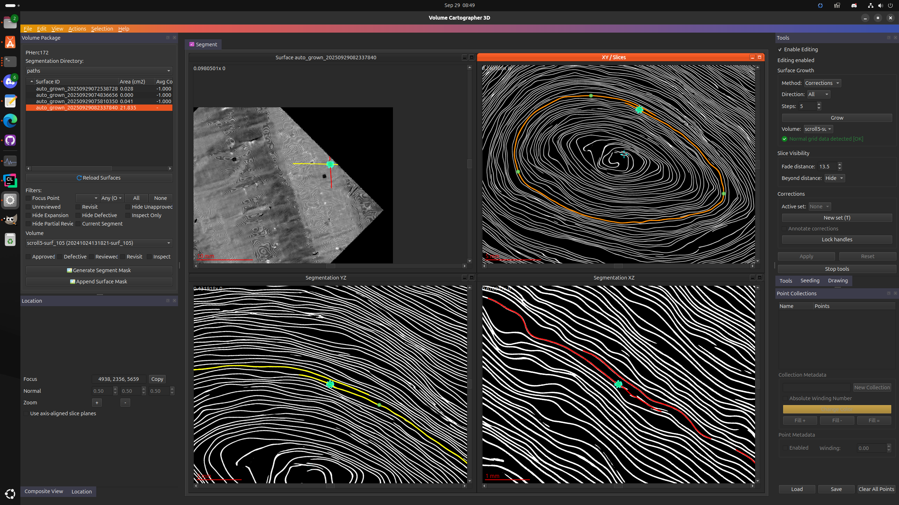
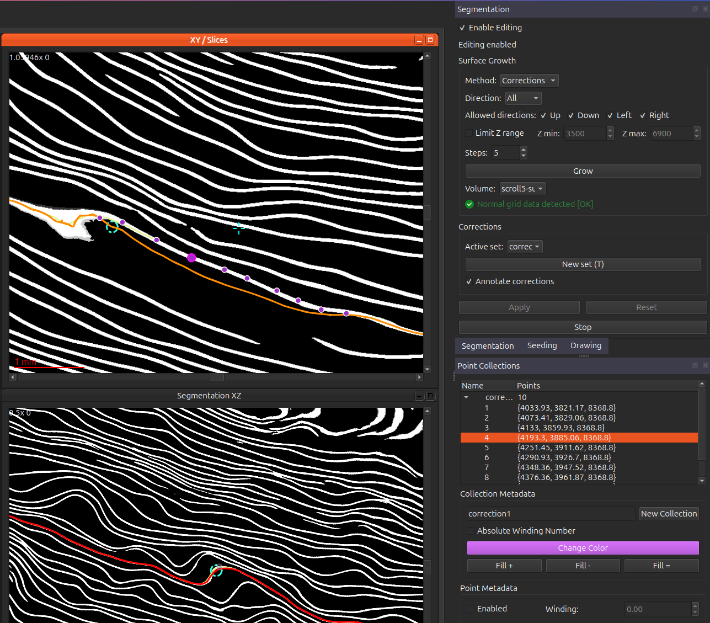

Segmentation growth and editing is now supported within the segmentation widget. Starting from a seed patch (or some segmentation imported into vc3d), you can grow them using the tracing method used during regular patch growth, and influence the direction it grows or modify its underlying geoemetry right in vc3d.

This is relatively untested, but (should) work. It's possible to easily create relatively large segmentations rather quickly -- i created this nearly 22cm segmentation in less than 5 minutes. 

**prerequisites** 
- you must have computed normal grids in the volpkg directory stored as `/path/to/example.volpkg/normal_grids/`
  - to compute these, run `/path/to/build/bin/vc_compute_normal_grids` , use the help option to see the options (or just enter it without any arguments)
- you must have the latest branch of volume-cartographer checked out (as this contains major changes that are required for this to work)
- you must have an existing patch or sgementation, or create one using the seeding widget

**methods**

there are two main ways to influence growth of a segmentation:
- mesh deformation (done by simply clicking near the segmentation to pull its vertices)
- correction points

these can be used together, or independently -- the mesh deformation at times creates some undesirable geometry, so it's recommended for now to stick mostly with correction points, but this is something we're continuing to work on. 

**useage**

1. open a volpkg 
2. click on the segmentation you want to edit
3. ensure `enable editing` is checked
4. ensure the mode is set to `corrections`
5. inspect the patch and see if there are any areas that have strayed from the correct path and require corrections
   6. if you find one , press `T` to begin a new point collection. each point collection is itself a single "correction". The first point you place is "special" and should be placed on the spot where the patch strayed off course, and the remaining should be placed on the path that the patch should have followed. 
   7. find any other areas to correct (if they exist) and press `T` again to create a new collection
   8. if you desire , you can deform the mesh by clicking near the segmentation line , the mesh should "pull" towards the clicked location
9. once you've completed all your corrections, set the number of `steps` (aka generations) you would like to grow, the directions you'd like to grow in , and any z limits you may want to apply. 
10. click the `grow` button , and the patch will grow for that number of generations. i'd stick with a small number of steps for now, likely somewhere between 5-20, as its easier to correct a small error than one that has gone on for some time
11. repeat steps 9-10 until you feel like stopping